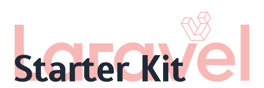

<h1 align="center">
    <a href="https://github.com/ideal-creative-lab/laravel-starter-kit#gh-dark-mode-only">
        
    </a>
    <a href="https://github.com/ideal-creative-lab/laravel-starter-kit#gh-light-mode-only">
        
    </a>
</h1>

<p align="center">
    <i align="center">This is a starter kit for Laravel projects</i>
</p>

<h4 align="center">
    
    
    
</h4>

## Introduction
The **Laravel Starter Kit** is a collection of tools and libraries designed to speed up the initial bootstrapping process for new Laravel projects. It includes several useful packages and tools that will help you get started quickly and easily developing web applications in Laravel.


> [!IMPORTANT]
> Before contributing to the project, please, carefully read through this README document.

## Included Packages
The **Laravel Starter Kit** includes the following packages and tools:

- [Laravel IDE Helper](https://github.com/barryvdh/laravel-ide-helper): Enhances the Laravel development experience with IDE support.
- [Laravel Lang](https://github.com/overtrue/laravel-lang): Simplifies language management in Laravel applications, ideal for multilingual projects.
- [Spatie's Ray](https://github.com/spatie/ray): A powerful real-time debugging tool that provides a new level of insight into Laravel applications.
- [Laravel Telescope](https://laravel.com/docs/10.x/telescope): A full-featured debugging and introspection tool for Laravel applications.
- [Laravel Pint](https://laravel.com/docs/10.x/pint): A opinionated PHP code style fixer for Laravel applications.
- [Pest](https://pestphp.com/): A modern and elegant testing framework for writing tests in PHP.

## Requirements
To run the project, you must first install PHP and the dependency manager Composer. Server requirements are as follows:

* **PHP** >= 8.1
* **composer**
* Ctype PHP Extension
* cURL PHP Extension
* DOM PHP Extension
* Fileinfo PHP Extension
* Filter PHP Extension
* Hash PHP Extension
* Mbstring PHP Extension
* OpenSSL PHP Extension
* PCRE PHP Extension
* PDO PHP Extension
* Session PHP Extension
* Tokenizer PHP Extension
* XML PHP Extension
* **MariaDB**

## ️Installation
Follow these steps to install and set up your project:

> [!NOTE]
> To streamline the installation process, we've provided a setup script, `./setup.sh`. This script is designed to automate the initial setup steps for a Laravel application, saving you time and ensuring a consistent setup.

1. Clone the repository:
```zsh
git clone git@github.com:ideal-creative-lab/laravel-starter-kit.git
```

2. Navigate to the project directory:
```zsh
cd laravel-starter-kit
```

3. Install PHP dependencies:
```zsh
composer install
```

4. Copy and edit the environment file:
```zsh
cp .env.example .env
```

5. Configure your database connection by editing the `.env` file:
```zsh
vim .env
```

6. Generate application key:
```zsh
php artisan key:generate
```

7. Install necessary [backend packages](https://github.com/ideal-creative-lab/laravel-starter-kit/wiki/How-to-install-backend-packages):
```zsh
php artisan install:backend
```

8. Run migrations:
```zsh
php artisan migrate
```

9. Install [frontend stack](https://github.com/ideal-creative-lab/laravel-starter-kit/wiki/How-to-install-frontend-components):
```zsh
php artisan install:frontend
```
> [!WARNING]
> To avoid duplication, make sure you run the command once for a specific stack!

10. **_(Optional)_** Install the [authentication component](https://github.com/ideal-creative-lab/laravel-starter-kit/wiki/How-to-install-the-authentication-component):
```zsh
php artisan install:auth
```

11. Start the server:
```zsh
php artisan serve
```

You should see a success message with the host and port of the running server, which is [http://127.0.0.1:8000](http://127.0.0.1:8000) by default.

> [!NOTE]
> For hot reloading, you can use the package manager you selected in step 9.

## Usage
After installation, you are ready to start developing your Laravel application. The Laravel Starter Kit provides a solid foundation and includes several packages to enhance your development experience.

## CI/CD
You can use the [Auto Deploy Github Action](/.github/workflows/deploy.yml) to deploy your project to [Ploi](https://ploi.io). It will be triggered on push to `main` branch, you can change it if you want.

The following steps will help you get started:

1. Add your app to the Ploi server.
2. Open your app in the control panel.
3. Press the `Repository` tab.
4. Scroll down to the `Deploy Webhook URL` section.
5. Copy the webhook URL.
6. Add the link to the github secrets of the app repository.

## Contribute
We welcome contributions from other developers. Please see [CONTRIBUTING.md](CONTRIBUTING.md) for ways to get started.

## Credits
This project has been developed by the team of **Ideal Creative Lab**.

We would like to acknowledge the contributions of the Laravel community and the creators of the included packages.
